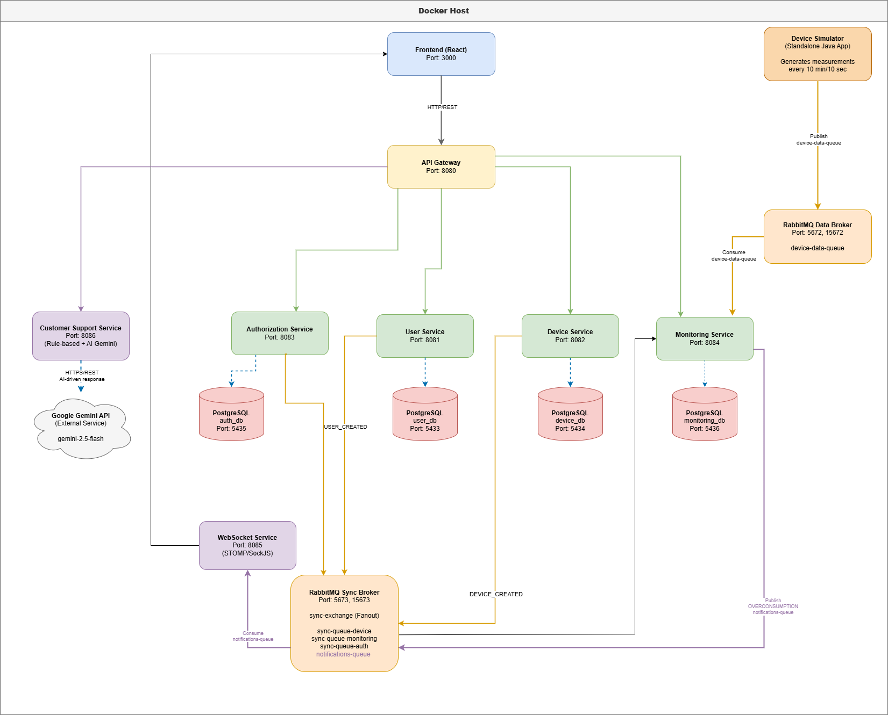

# Energy Management System

A web application for monitoring the energy consumption of smart devices, built with a microservice architecture.

Administrators manage users and devices and assign devices to clients. Each device sends a measurement every 10 minutes; the system adds them up per hour and alerts the device owner in real time when the hourly consumption goes over the device's limit.

Originally built as a university project and later refactored.

## Features

**Administrator**
- Create, edit and delete user accounts (client or administrator)
- Create, edit and delete devices, each with a maximum hourly consumption (kWh)
- Assign devices to clients and unassign them

**Client**
- View the assigned devices and their hourly limits
- Receive real-time alerts when a device goes over its limit
- Ask questions in a support chat (predefined answers, with an optional AI fallback)

## Tech stack

| Area | Technologies |
|---|---|
| Backend | Java 21, Spring Boot 3.5, Spring Data JPA, Spring Security, Spring Cloud Gateway |
| Messaging | RabbitMQ, WebSocket (STOMP) |
| Database | PostgreSQL (one database per service) |
| Frontend | React 19, TypeScript, Vite, Tailwind CSS, TanStack Query |
| Infrastructure | Docker, Docker Compose, nginx |

## Architecture



| Service | Port | Responsibility |
|---|---|---|
| Frontend | 3000 | React application served by nginx |
| API Gateway | 8080 | Single entry point; routes requests and validates JWT tokens |
| User Service | 8081 | User profiles (full name, address) |
| Device Service | 8082 | Devices and their assignment to clients |
| Authorization Service | 8083 | Registration, login, password hashing, JWT generation |
| Monitoring Service | 8084 | Hourly consumption and overconsumption detection |
| WebSocket Service | 8085 | Pushes alerts to the browser of the device owner |
| Customer Support Service | 8086 | Support chatbot |

**How the services communicate**

- **REST**: the frontend calls only the API Gateway, which forwards each request to the matching service.
- **Data broker (RabbitMQ)**: the device simulator sends measurements to the Monitoring Service.
- **Sync broker (RabbitMQ)**: services publish events such as `USER_CREATED`, `DEVICE_ASSIGNED` or `DEVICE_DELETED` on a fanout exchange, so each service keeps its own copy of the data it needs.
- **WebSocket**: overconsumption alerts go from the Monitoring Service, through RabbitMQ, to the WebSocket Service, which sends them to `/topic/notifications/{userId}`.

**Hourly consumption.** A measurement is the average power over 10 minutes, in watts. The energy it represents is `W / 1000 × 1/6 h = W / 6000 kWh`. Measurements are added to the total of their hour; when the total goes over the device limit, the owner receives one alert for that hour.

## Getting started

### Prerequisites

- Docker and Docker Compose
- Java 21 and Maven, only for running the device simulator

### Run the application

```bash
git clone https://github.com/tavim26/energy-management-system.git
cd energy-management-system

cp .env.example .env
# set ADMIN_PASSWORD in .env

docker compose up -d --build
```

The first build takes a few minutes. Then open http://localhost:3000 and log in with `ADMIN_USERNAME` / `ADMIN_PASSWORD` from `.env`. Client accounts can be created by the administrator or from the **Register** page.

### Configuration

| Variable (`.env`) | Description |
|---|---|
| `ADMIN_USERNAME`, `ADMIN_PASSWORD` | First administrator account, created on startup if no administrator exists |
| `GEMINI_API_KEY` | Optional. Without it, the chatbot answers only with its predefined rules |

### Run the device simulator

The simulator runs locally and sends measurements to the data broker on `localhost:5672`.

1. Create a device in the application, assign it to a client and note its id.
2. Set `device.id` in `device-simulator/src/main/resources/config.properties`.
3. Build and start the simulator:

```bash
cd device-simulator
mvn clean package
java -jar target/device-simulator.jar src/main/resources/config.properties
```

Choose a mode when asked:

- **Fast-forward** sends a measurement every 5 seconds, and each one advances the simulated clock by 10 minutes. Use it to see hourly totals and alerts quickly.
- **Normal** sends a measurement every 10 minutes, in real time.

To see an alert, give the device a low limit (for example `1` kWh), log in as its owner and start the simulator in fast-forward mode.

### Useful URLs

| URL | Description |
|---|---|
| http://localhost:3000 | Web application |
| http://localhost:15672 | RabbitMQ data broker (guest / guest) |
| http://localhost:15673 | RabbitMQ sync broker (guest / guest) |
| `http://localhost:<service port>/swagger-ui.html` | API documentation of each service |

## Project structure

```
├── backend/
│   ├── api-gateway/
│   ├── authorization-service/
│   ├── user-management/
│   ├── device-management/
│   ├── monitoring-service/
│   ├── websocket-service/
│   └── customer-support-service/
├── device-simulator/      # standalone Java application
├── frontend/              # React + TypeScript application
├── docker-compose.yml
└── .env.example
```

## License

This project is licensed under the MIT License. See [LICENSE](LICENSE).
